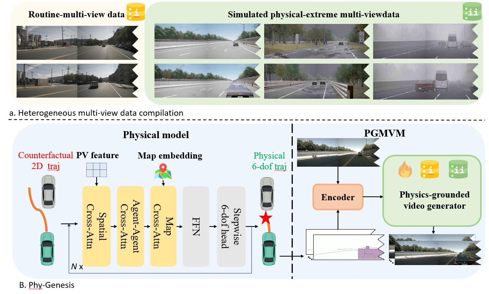

<div align="center">
<h3> PhyGenesis: Toward Physically Consistent Driving Video World Models under Challenging Trajectories</h3>

Jiawei Zhou<sup>1,2*</sup>, Zhenxin Zhu<sup>2*</sup>, Lingyi Du<sup>1*</sup>, Linye Lyu<sup>3</sup>, Lijun Zhou<sup>2</sup>, Zhanqian Wu<sup>2</sup>, <br> Hongcheng Luo<sup>2</sup>, Zhuotao Tian<sup>4</sup>, Bing Wang<sup>2</sup>, Guang Chen<sup>2</sup>, Haiyang Sun<sup>2†</sup>, Hangjun Ye<sup>2‡</sup>, Yu Li<sup>1‡</sup>

<sup>1</sup> Zhejiang University &nbsp;&nbsp;&nbsp;
<sup>2</sup> Xiaomi EV &nbsp;&nbsp;&nbsp;
<sup>3</sup> The Hong Kong Polytechnic University &nbsp;&nbsp;&nbsp;
<sup>4</sup> Shenzhen Loop Area Institute

(*) Equal contribution. (†) Project leader. (‡) Corresponding Author.

<a href="#"></a>
<a href="https://wm-research.github.io/PhyGenesis/"></a>
</div>

## News
`[2026/03/20]` Project page is officially released. Welcome to check our visual results!
`[2026/03/xx]` We will release our Paper on arXiv soon! Please stay tuned! ☕️

## Updates
- [x] Release Project Page  
- [ ] Release Paper   
- [ ] Release inference & training codes  
- [ ] Release model weights 

## Abstract
Video generation models have shown strong potential as world models for autonomous driving simulation. However, existing approaches are primarily trained on real-world driving datasets, which mostly contain natural and safe driving scenarios. As a result, current models often fail when conditioned on challenging or counterfactual trajectories—such as imperfect trajectories generated by simulators or planning systems—producing videos with severe physical inconsistencies and artifacts.

To address this limitation, we propose **PhyGenesis**, a world model designed to generate driving videos with high visual fidelity and strong physical consistency. Our framework consists of two key components: (1) a *physical condition generator* that transforms potentially invalid trajectory inputs into physically plausible conditions, and (2) a *physics-enhanced video generator* that produces high-fidelity multi-view driving videos under these conditions.

To effectively train these components, we construct a large-scale, physics-rich heterogeneous dataset. Specifically, in addition to real-world driving videos, we generate diverse challenging driving scenarios using the CARLA simulator, from which we derive supervision signals that guide the model to learn physically grounded dynamics under extreme conditions. This challenging-trajectory learning strategy enables trajectory correction and promotes physically consistent video generation. Extensive experiments demonstrate that PhyGenesis consistently outperforms state-of-the-art methods, especially on challenging trajectories.

## Overview
<div align="center">

</div>

## Acknowledgments
- Built on [Wan2.1](https://github.com/Wan-Video/Wan2.1)
- Built on [DiffusionDrive](https://github.com/Jiawei-Zho/DiffusionDrive)

## Citation
If you find PhyGenesis is useful in your research or applications, please consider giving us a star 🌟 and citing it by the following BibTeX entry.

```bibtex
@article{zhou2026phygenesis,
  title={Toward Physically Consistent Driving Video World Models under Challenging Trajectories},
  author={Zhou, Jiawei and Zhu, Zhenxin and Du, Lingyi and Lyu, Linye and Zhou, Lijun and Wu, Zhanqian and Luo, Hongcheng and Tian, Zhuotao and Wang, Bing and Chen, Guang and Sun, Haiyang and Ye, Hangjun and Li, Yu},
  journal={arXiv preprint},
  year={2026}
}
```